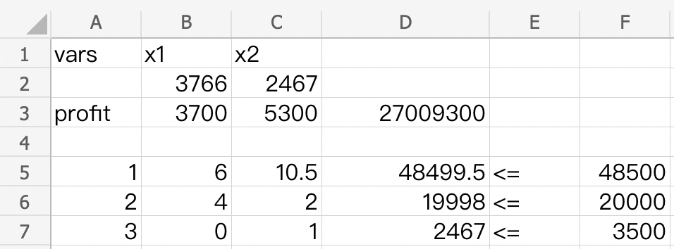

# Math 132A Project 1

## Problem Solving

- Family Adventurer
  - 4 doors
- Classic Transporter
  - 2 doors

1. Let 

   $x_1$ be the number of Family Adventurers to be produced.

   $x_2$ be the number of Classic Transporters to be produced. 

   $z$ be the profit to be maximized

   We formulate our problem as the following
   $$
   \begin{cases}
    		\text{Maximize  } \rightarrow z = 3700x_1 + 5300x_2\\
    		\text{Subject to:}\\
    		6x_1 +10.5x_2 \leq 48500\\
    		4x_1 + 2x_2 \leq 20000\\
    		x_2 \leq 3500\\
    		x_1 \geq 0, x_2 \geq 0
    \end{cases}
   $$
   As we can see in the formulation, we want to maximize the profit $z$, which is subject to individual profits of each car model. The first constraint was due to labor hours. The second constraint was due to car doors and the third constraint was brought by the company forecast.

2. Now we will solve the problem using Excel:

   

   We found that the optimal solution is when 
   $$
   \begin{cases}
    		x_1 = 3766\\ 
    		x_2 = 2467
    \end{cases}
   $$
   generating a profit of 
   $$
   3700 \times 3766 + 5300 \times 2467 = 27009300 \text{   dollars}
   $$
   To verify that the solution is unique, we plot out the feasible regions as shown below:

   

   We can see from the above plot, that the conditions form a polygon boundary. Since the objective function is not parellel to any of the boundary, there exists an unique optimal to this linear programming problem. Hence there exists an unique solution.

3. Since the target campain cost $\$ 500000$, this means that we should take out $500000$​ in the target function. And since this campaign will raise the demand demand for the Classic Transporter next month by $20$ percent,  we have the new Linear Programming Problem:
    $$
    \begin{cases}
     		\text{Maximize  } \rightarrow z = 3700x_1 + 5300x_2 -500000\\
     		\text{Subject to:}\\
     		6x_1 +10.5x_2 \leq 48500\\
     		4x_1 + 2x_2 \leq 20000\\
     		x_2 \leq 4200\\
     		x_1 \geq 0, x_2 \geq 0
     \end{cases}
    $$
    We found that the optimal solution is when 
    $$
    \begin{cases}
     		x_1 = 3766\\ 
     		x_2 = 2467
     \end{cases}
    $$
    generating a profit of 
    $$
    3700 \times 3766 + 5300 \times 2467 - 500000 = 26509300 \text{   dollars}
    $$
    But this is less than the original profit, which is $27009300$ dollars, so William Smith **should not undertake the campaign.**

4. Since William Smith can increase the plant capacity by $25$ percent, now he has $48500 \times 1.25 = 60625$ labor hours. Now we have the new linear programming problem:
    $$
    \begin{cases}
     		\text{Maximize  } \rightarrow z = 3700x_1 + 5300x_2\\
     		\text{Subject to:}\\
     		6x_1 +10.5x_2 \leq 60625\\
     		4x_1 + 2x_2 \leq 20000\\
     		x_2 \leq 3500\\
     		x_1 \geq 0, x_2 \geq 0
     \end{cases}
    $$
    We found that the optimal solution is when 
    $$
    \begin{cases}
     		x_1 = 3250\\ 
     		x_2 = 3500
     \end{cases}
    $$
    generating a profit of 
    $$
    3700 \times 3250 + 5300 \times 3500 = 30575000 \text{   dollars}
    $$
    Therefore, **William Smith should now produce $3250$ Family Adventurers and $3500$ Classic Transporters**.

5. Without the overtime, the company earns a profit of $27009300$ dollars. With overtime, the company now earns a profit of $30575000$ dollars. **So the maximum amount of money William Smith would like to pay is $3565700$ dollars.**
    $$
    30575000 - 27009300 = 3565700 \text{ dollars}
    $$

6. Implementing both advertising and overtime labor will give the new linear programming problem:
    $$
    \begin{cases}
     		\text{Maximize  } \rightarrow z = 3700x_1 + 5300x_2 - 500000\\
     		\text{Subject to:}\\
     		6x_1 +10.5x_2 \leq 60625\\
     		4x_1 + 2x_2 \leq 20000\\
     		x_2 \leq 4200\\
     		x_1 \geq 0, x_2 \geq 0
     \end{cases}
    $$
    We found the solution of this linear programming problem to be
    $$
    \begin{cases}
     		x_1 = 2957\\ 
     		x_2 = 4084
     \end{cases}
    $$
    which generates a profit of 
    $$
    3700 \times 2957 + 5300 \times 4084 - 500000 = 32086100 \text{   dollars}
    $$
    **Therefore, William Smith should now produce $2957$ Family Adventurers and $4084$ Classic Transporters**.

7. Since the overtime labor costs $1600000$ dolars, the new profit for implementing both advertising and overtime labor yields a profit of 
    $$
    32086100 - 1600000 = 30486100 \text{ dollars}
    $$
    And we have $30486100 > 27009300 \text{ dollars}$ we implementing both **is a wise decision comparing to the result from problem (1)**.

8. There will be four scenarios. Notice that **we assume that the overtime pay does not cost extra money.**

    1. using both advertising and overtime labor

        Now the linear programming problem becomes:
        $$
        \begin{cases}
         		\text{Maximize  } \rightarrow z = 2800x_1 + 5300x_2 -500000\\
         		\text{Subject to:}\\
         		6x_1 +10.5x_2 \leq 60625\\
         		4x_1 + 2x_2 \leq 20000\\
         		x_2 \leq 4200\\
         		x_1 \geq 0, x_2 \geq 0
         \end{cases}
        $$
        We found that the solution to this linear programming problem is 
        $$
        \begin{cases}
         		x_1 = 2754\\ 
         		x_2 = 4200
         \end{cases}
        $$
        generating a profit of
        $$
        2800 \times 2754 + 5300 \times 4200 - 500000 = 29471200 \text{   dollars}
        $$

    2. using overtime labor only

        Now the linear programming problem becomes:
        $$
        \begin{cases}
         		\text{Maximize  } \rightarrow z = 2800x_1 + 5300x_2\\
         		\text{Subject to:}\\
         		6x_1 +10.5x_2 \leq 60625\\
         		4x_1 + 2x_2 \leq 20000\\
         		x_2 \leq 3500\\
         		x_1 \geq 0, x_2 \geq 0
         \end{cases}
        $$
        We found that the solution to this linear programming problem is 
        $$
        \begin{cases}
         		x_1 = 3250\\ 
         		x_2 = 3500
         \end{cases}
        $$
        generating a profit of
        $$
        2800 \times 3200 + 5300 \times 3500 = 27650000 \text{   dollars}
        $$

    3. using advertising only

        Now the linear programming problem becomes:
        $$
        \begin{cases}
         		\text{Maximize  } \rightarrow z = 2800x_1 + 5300x_2 -500000\\
         		\text{Subject to:}\\
         		6x_1 +10.5x_2 \leq 48500\\
         		4x_1 + 2x_2 \leq 20000\\
         		x_2 \leq 4200\\
         		x_1 \geq 0, x_2 \geq 0
         \end{cases}
        $$
        We found that the solution to this linear programming problem is 
        $$
        \begin{cases}
         		x_1 = 735\\ 
         		x_2 = 4199
         \end{cases}
        $$
        generating a profit of
        $$
        2800 \times 735 + 5300 \times 4199 - 500000 = 23812700 \text{   dollars}
        $$

    4. using neither advertising nor overtime labor

        Now the linear programming problem becomes:
        $$
        \begin{cases}
         		\text{Maximize  } \rightarrow z = 2800x_1 + 5300x_2\\
         		\text{Subject to:}\\
         		6x_1 +10.5x_2 \leq 48500\\
         		4x_1 + 2x_2 \leq 20000\\
         		x_2 \leq 3500\\
         		x_1 \geq 0, x_2 \geq 0
         \end{cases}
        $$
        We found that the solution to this linear programming problem is 
        $$
        \begin{cases}
         		x_1 = 1960\\ 
         		x_2 = 3499
         \end{cases}
        $$
        generating a profit of
        $$
        2800 \times 1960 + 5300 \times 3499 = 24032700 \text{   dollars}
        $$

    Comparing all four scenarios, option 1 generates a profit of $29471200$ dolloars, which is the most. So William Smith should **consider implenting both advertising and overtime labor.**

9. With the new time to assemble the Adventurer, assume that William is not implementing advertisesment or overtime labor, and the profit of adventurer did not drop, we have the linear programming problem as follows:
    $$
    \begin{cases}
     		\text{Maximize  } \rightarrow z = 3700x_1 + 5300x_2\\
     		\text{Subject to:}\\
     		7.5x_1 +10.5x_2 \leq 48500\\
     		4x_1 + 2x_2 \leq 20000\\
     		x_2 \leq 3500\\
     		x_1 \geq 0, x_2 \geq 0
     \end{cases}
    $$
    We found that the optimal solution is when 
    $$
    \begin{cases}
     		x_1 = 1568\\ 
     		x_2 = 3499
     \end{cases}
    $$
    generating a profit of 
    $$
    3700 \times 1568 + 5300 \times 3499 = 24346300 \text{   dollars}
    $$
    **Therefore, William Smith should now produce $1568$ Family Adventurers and $3499$ Classic Transporters**.

10. If the full demand of Classic Transporters are met, then the Linear Programming Problem becomes:
    $$
    \begin{cases}
     		\text{Maximize  } \rightarrow z = 3700x_1 + 5300x_2\\
     		\text{Subject to:}\\
     		6x_1 +10.5x_2 \leq 48500\\
     		4x_1 + 2x_2 \leq 20000\\
     		x_2 = 3500\\
     		x_1 \geq 0, x_2 \geq 0
     \end{cases}
    $$
    We found that the optimal solution is when 
    $$
    \begin{cases}
     		x_1 = 1958\\ 
     		x_2 = 3500
     \end{cases}
    $$
    generating a profit of 
    $$
    3700 \times 1958 + 5300 \times 3500 = 24032400 \text{   dollars}
    $$
    And comparing the profit in (1),
    $$
    27009300 - 24032400 = 2976900 \text{ dollars} > 2000000 \text{ dollars}
    $$
    So **William should not meet the full demand.**

11. Combining all the situations in (6), (7), (8), we formulate the linear programming problem as follows:
    $$
     \text{Similar to (8)}
    $$
    

### 
