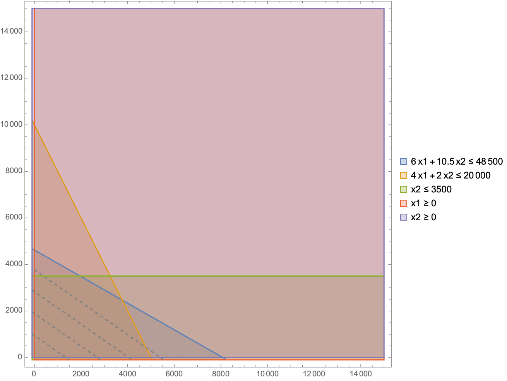

- Family Adventurer
  - 4 doors
- Classic Transporter
  - 2 doors

1. Let 

   $x_1$ be the number of Family Adventurers to be produced.

   $x_2$ be the number of Classic Transporters to be produced. 

   $z$ be the profit to be maximized

   We formulate our problem as the following
   $$
   \begin{cases}
    		\text{Maximize  } \rightarrow z = 3700x_1 + 5300x_2\\
    		\text{Subject to:}\\
    		6x_1 +10.5x_2 \leq 48500\\
    		4x_1 + 2x_2 \leq 20000\\
    		x_2 \leq 3500\\
    		x_1 \geq 0, x_2 \geq 0
    \end{cases}
   $$
   As we can see in the formulation, we want to maximize the profit $z$, which is subject to individual profits of each car model. The first constraint was due to labor hours. The second constraint was due to car doors and the third constraint was brought by the company forecast.

2. Now we will solve the problem using Excel:

   We found that the optimal solution is when 
   $$
   \begin{cases}
    		x_1 \geq 5000\\ 
    		x_2 \geq 0
    \end{cases}
   $$
   generating a profit of 
   $$
   3700 \times 5000 + 5300 \times 0 = 18500000 \text{   dollars}
   $$
   To verify that the solution is unique, we plot out the feasible regions as shown below:
   
   
   
   We can see from the above plot, that the conditions form a polygon boundary. Since the objective function is not parellel to any of the boundary, there exists an unique optimal to this linear programming problem. Hence there exists an unique solution.

3. The campaign should be undertaken:

